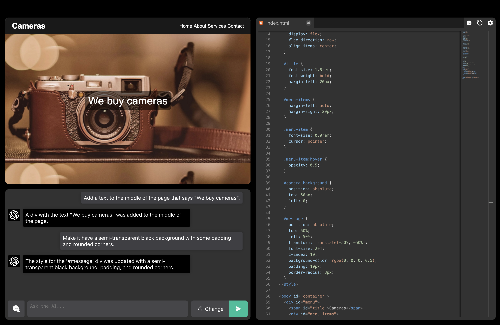

# GPTerraform: A Conversational Website Editor

GPTerraform is an application that lets users write HTML, CSS and JavaScript code in a code editor, while also being able to chat to a GPT-powered artificial intelligence, who can also make changes to the codebase. The interaction between the user and assistant is helped by several features, such as it coming up with several suggested solutions for a request, the ability to highlight elements visually or in code to give as context and reverting to previous states of the code and conversation. These features are explained in a guided tour when starting the application.

## Usage

GPTerraform is a research preview, not a commercial product, and therefore, there are no OpenAI keys provided. You need to provide your own API key and organization ID in the `.env` file. You can sign up to be an OpenAI developer to get these at [OpenAI Product](https://openai.com/product).

A correct `.env` configuration looks like this:

    REACT_APP_OPENAI_ORG_ID="org-ID"
    REACT_APP_OPENAI_API_KEY="sk-ID"

Running the application locally includes the following steps:

- Install NodeJS and NPM from [NodeJS](https://nodejs.org/en). For development, Node v18.15.0 and NPM v9.5.0 were used but most recent versions should work too.
- Install dependencies by running `npm install`.
- Start the application by running `npm start`.
